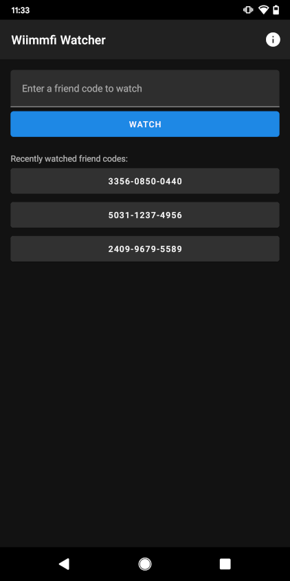
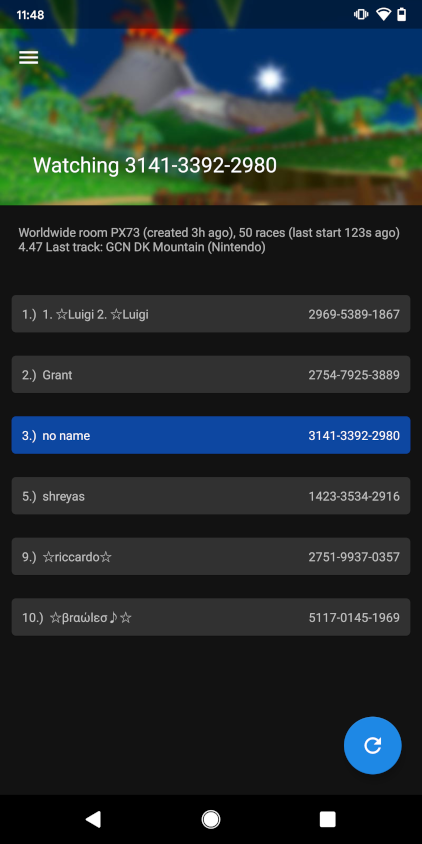

# ----- **NOTICE** -----

Wiimmfi Watcher's functionality is currently broken due to new DDoS protection currently implemented on Wiimmfi's domain since September 4th, 2021. All requests made by Wiimmfi Watcher currently returns `HTML Error 503: Service Unavailable`. Until a work around is found (which will be unlikely for a guy like me) or the DDoS protection is taken down, Wiimmfi Watcher may not work as expected.

# Wiimmfi Watcher

Wiimmfi Watcher is an unofficial Android application that allows you to watch Mario Kart Wii gameplay by simply entering your friend code. This application can be found on the Google Play Store [here!](https://play.google.com/store/apps/details?id=me.brysonsteck.wiimmfiwatcher) This app can be used in several different languages.

This application is currently being maintained by myself out of love for Mario Kart Wii and appreciation for the developers of Wiimmfi. I am in no way affiliated with Wiimmfi or any of the Wiimmfi developers.

## Screenshots

## Download

You can visit the Google Play Store to download the most recent and stable version [here!](https://play.google.com/store/apps/details?id=me.brysonsteck.wiimmfiwatcher) You are also free to clone the repository and download the source code for the most stable release in the Releases tab if you would like to build it from scratch.

## Feedback and Bugs

This is officially my first project and Google Play app that I'm maintaining, so if you have any feedback about my work, I would love to hear it! You can create an issue tagged "feedback", or you can fill out this [Google Form](https://docs.google.com/forms/d/e/1FAIpQLSd6qCONAP2tsbHPgzu_CdZcHVHL5nx7q0XFqrVfExEc84kqUQ/viewform). I also have a section in my TODO list under "Features I would like to add" for things I am already considering adding to future releases.

Additionally, If you find any bugs in the app (the `master` branch contains the same code as the latest release), you can create an issue here on GitHub or fill out the Google Form linked before in a similar manner. Please only submit bugs that pertain to the [most recent release.](https://github.com/brysonsteck/wiimmfi-watcher/releases)

## Donations

This application is completely free, ad-less and open source. That means that no income is coming from this app and the work done on this app is purely a labor of love <3

If you'd like to donate to this project, I'd ask that you first [donate to Wiimmfi.](https://wiimmfi.de/donate) This app nor my 3,069+ hours of fun on their service would not be possible without them.

Once you donate to them or you choose not to (why?? :( how sad), then here are ways you can donate to me:
* [PayPal](https://www.paypal.com/donate/?business=steck.bryson%40gmail.com&item_name=Bryson+Steck&currency_code=USD&Z3JncnB0=)
* Bitcoin: 1Kbnp5JMTKd7a3Zs2WWm2JMCjfVb5tpcky
* Litecoin: LRboJVNzoJCjXHmwN6RQgyvYEQjjaFzEA7
* Dogecoin: DMx362YBEBYw1uDGetX3svdg8RypHsWTCS

Please note that donations are **NOT** required and does **NOT** add or remove functionality from the app.

## License

&copy; 2021-2022 Bryson Steck. Wiimmfi Watcher is licensed under the [GPL-3.0](LICENSE).

Wiimmfi Watcher is free software: you can redistribute it and/or modify
it under the terms of the GNU General Public License as published by
the Free Software Foundation, either version 3 of the License, or
(at your option) any later version.

Wiimmfi Watcher is distributed in the hope that it will be useful,
but WITHOUT ANY WARRANTY; without even the implied warranty of
MERCHANTABILITY or FITNESS FOR A PARTICULAR PURPOSE.  See the
GNU General Public License for more details.

You should have received a copy of the GNU General Public License
along with Wiimmfi Watcher.  If not, see <https://www.gnu.org/licenses/>.

## Credits

Wiimmfi Watcher is made possible by the following:
* [Wiimmfi](https://wiimmfi.de) for being the complete backbone of this app.
* [Jsoup](https://jsoup.org) version 1.13.1, which powers getting the information from Wiimmfi with HTML parsing. (This will soon be replaced in favor of JSON parsing.)
* [Gson](https://github.com/google/gson) version 2.8.7, which powers the updater.
