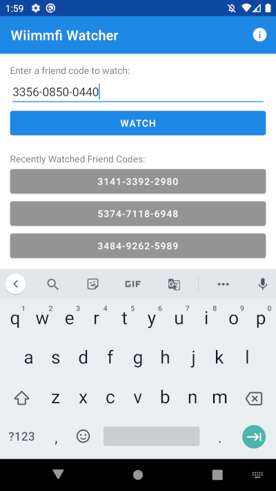
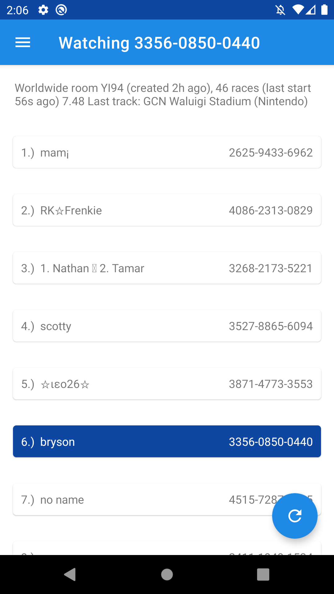
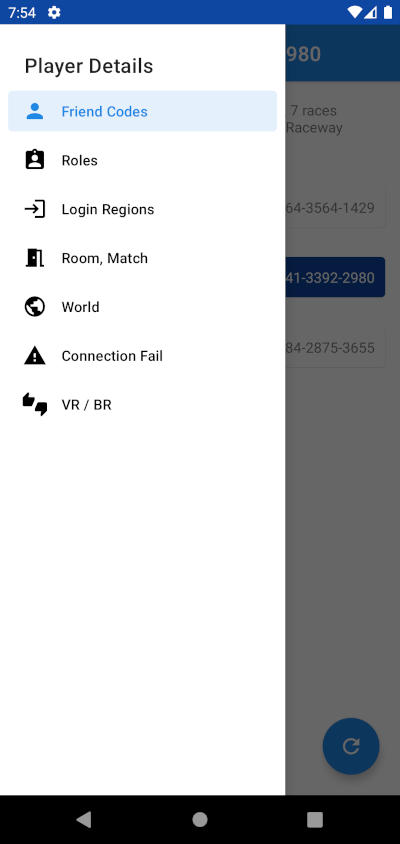
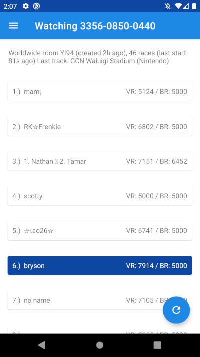
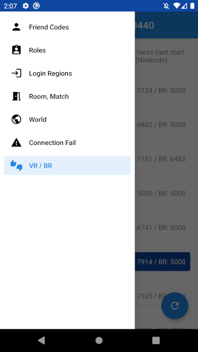
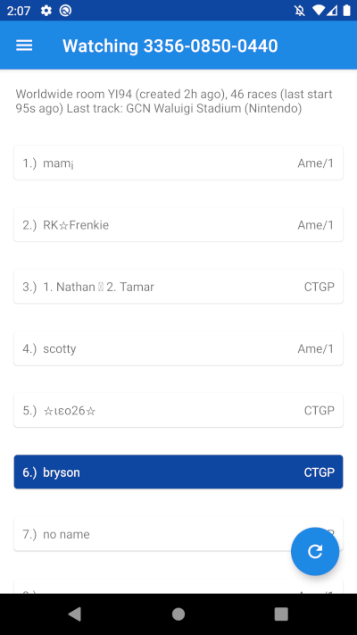

# Wiimmfi Watcher

Wiimmfi Watcher is an Android application that allows you to watch Mario Kart Wii gameplay by simply entering your friend code. This application can be found on the Google Play Store here (link goes here when created)!

This application is currently being maintained by myself out of love for Mario Kart Wii and appreciation for the developers of Wiimmfi. I am in no way affiliated with Wiimmfi or any of the Wiimmfi developers.

## Screenshots

## Download

You can visit the Google Play Store to download the most recent and stable version (link goes here once approved). You are also free to clone the repository and download the source code for the most stable release in the Releases tab. 

## Feedback

This is officially my first project and Google Play app that I'm maintaining, so if you have any feedback about my work, I would love to hear it! You can create an issue tagged "feedback", or you can fill out this Google Form. (Create google form) I also have a section in my TODO list under "Features I would like to add" for things I am already considering adding to future releases.

## Bugs

If you found any bugs in the `master` branch (i. e. the most recent Google Play release), **PLEASE READ MY [TODO LIST](https://github.com/brysonsteck/wiimmfi-watcher/blob/dev/TODO.md) FIRST** to make sure that the bug you found isn't something I'm already aware of. Once you have made sure of that, you can then create an issue or fill out this [Google Form](https://docs.google.com/forms/d/e/1FAIpQLSd6qCONAP2tsbHPgzu_CdZcHVHL5nx7q0XFqrVfExEc84kqUQ/viewform).

## Software

Wiimmfi Watcher is made possible using the Jsoup HTML parser, version 1.13.1. You can visit their website [here.](jsoup.org) 
